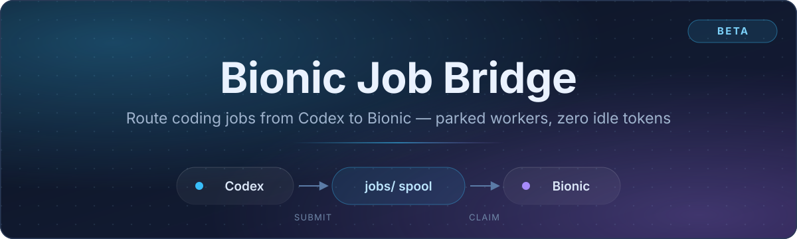
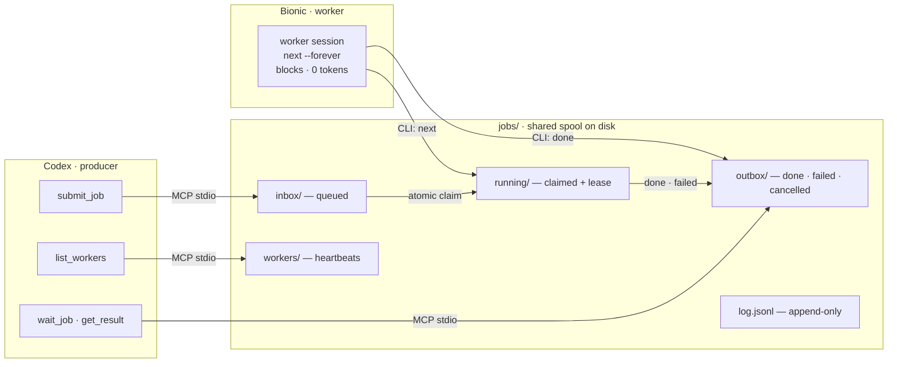
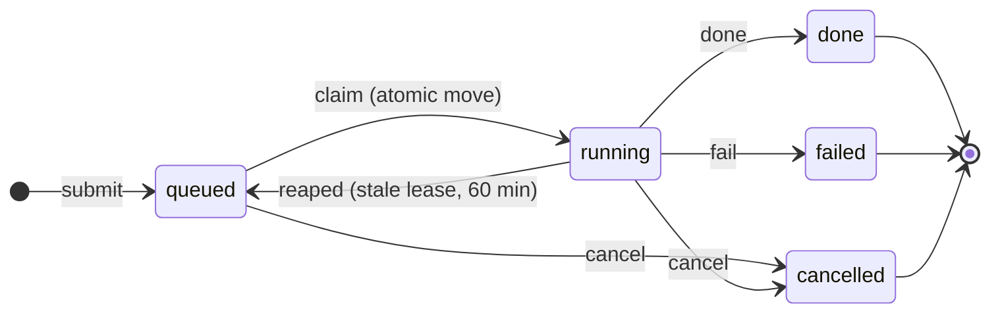

<div align="center">



# Bionic Job Bridge

**Hand coding work from Codex to Bionic, and get the results back — with workers that cost nothing while they wait.**

[](#beta-limitations)
[](#setup)
[](#code-overview)
[](#mcp-tool-reference)
[](#running-more-than-one-worker)

</div>

Codex submits a job, a Bionic worker session picks it up, does the work in the
job's working directory, and writes a result that Codex can read. Workers sit
parked on the queue and consume **no tokens while idle**.

> **Status: Beta.** The core loop is implemented and verified end-to-end (Codex
> submit → Bionic claim → work → result). The "start workers automatically" path
> depends on Codex's computer-use driving the Bionic GUI and has not yet been
> validated on a cold start. See [Beta limitations](#beta-limitations).

## Install with your AI

You do not need to download or configure anything by hand. Point an AI agent at
these files and it will clone the repo, register the MCP server, and install the
skills for you.

**In Codex** — paste this:

> Read https://raw.githubusercontent.com/neusse/Bionic-Slave/main/install/INSTALL-CODEX.md and install this for me.

**In Bionic** — paste this:

> Read https://raw.githubusercontent.com/neusse/Bionic-Slave/main/install/INSTALL-BIONIC.md and install this for me.

Install **both sides** to get the full loop. Each guide is self-contained and
clones the repo for you. Sources live in [`install/`](install/).

---

## Contents

- [Install with your AI](#install-with-your-ai)
- [Principles of operation](#principles-of-operation)
- [Architecture](#architecture)
- [Setup](#setup)
- [Using it from Codex](#using-it-from-codex)
- [Using it from Bionic](#using-it-from-bionic)
- [CLI reference](#cli-reference)
- [MCP tool reference](#mcp-tool-reference)
- [Data contracts](#data-contracts)
- [Code overview](#code-overview)
- [Troubleshooting](#troubleshooting)
- [Beta limitations](#beta-limitations)

---

## Principles of operation

### 1. Codex cannot push into Bionic — Bionic pulls

This is the central constraint and it shapes everything else. Bionic exposes no
external API, CLI, or endpoint that can create a session or inject a prompt:

- LM Studio's HTTP API (`/api/v0`, `/api/v1`) is **inference only** — no agent sessions.
- `lms chat` talks to a raw model — no tools, no workspace, no agent loop.
- `lms` has no `agent`/`session` subcommand.
- Bionic's `session_control` / `introspection` tools exist **only inside a Bionic session**.
- Bionic deep links (`bionic-session://`) are references, not prompt carriers.

So Codex can only *deposit* work. A Bionic worker must *pull* it. The bridge is
a shared on-disk queue for exactly that.

### 2. A parked worker costs ~zero tokens

Tokens are spent only when the model **generates** output. When a worker session
runs `next --forever`, that is a single blocking shell call: the model is waiting
on a tool result and generates nothing. Idle time in the queue is therefore free.

`--forever` (rather than a short `--wait`) also removes the per-cycle "loop
again" decision, so there is no recurring token cost while the queue is empty.

### 3. The spool on disk is the single source of truth

Job state lives in files, not in memory or in either app. Either side can restart
independently without losing state.

### 4. Claims are atomic; leases expire

Claiming is an atomic directory move (`os.replace` from `inbox/` to `running/`),
so any number of workers can poll the same queue and each job goes to exactly one
of them. The winner stamps a **lease**. If a worker dies mid-job, its lease goes
stale and the job is reaped back to `inbox/` (default: 60 minutes).

### 5. Workers are Bionic sessions, not daemons

A "worker" is a Bionic session running a loop. There is no background service.
This is a consequence of principle 1: only an agent session can do the agentic
work, and only a session can call the session-control tools.

### 6. Results are reported, not applied

A worker returns a summary, the files it changed, and test evidence. Nothing is
auto-committed or auto-merged — Codex (or you) reviews and applies.

---

## Architecture



Job lifecycle:



---

## Setup

> Prefer to let an AI do this? See [Install with your AI](#install-with-your-ai).
> The steps below are the manual equivalent.

### Prerequisites

| Requirement | Notes |
|---|---|
| Python 3.10+ | `py` or `python` on PATH (verified with 3.13). No third-party packages. |
| Codex CLI | `codex` on PATH (verified with the OpenAI Codex CLI). |
| Bionic | Installed at `C:\Program Files\Bionic\Bionic.exe`. |

### 1. Register the bridge as an MCP server in Codex

This is what lets Codex submit jobs and see workers:

```powershell
codex mcp add bionic-jobs -- "C:\Program Files\Python313\python.exe" `
  "C:\Users\<username>\Bionic-Projects\Bionic-Slave\bridge\bionic_jobs_mcp.py"
```

Verify:

```powershell
codex mcp get bionic-jobs
```

> `codex mcp list` shows the status as **"Unsupported"** for stdio servers. That
> is normal — it is the same label Codex shows for other working stdio servers.
> The server is verified by handshaking with it (see [Troubleshooting](#troubleshooting)).

### 2. (Optional) Register Codex as an MCP server inside Bionic

This is the reverse direction: it lets a Bionic session call Codex as a tool and
get results inline. Bionic owns `ng-mcp.json` while it runs, so **close Bionic
first**:

```powershell
pwsh -File bridge\install_codex_mcp_bionic.ps1
```

Or add it manually in Bionic's MCP settings:

```json
{
  "name": "codex",
  "enabled": true,
  "connection": {
    "type": "stdio",
    "command": "C:\\Users\\<username>\\AppData\\Local\\Programs\\OpenAI\\Codex\\bin\\codex.exe",
    "args": ["mcp-server"],
    "env": {},
    "cwd": "C:\\Users\\<username>\\Bionic-Projects\\Bionic-Slave"
  }
}
```

### 3. Smoke test

```powershell
cd C:\Users\<username>\Bionic-Projects\Bionic-Slave

# Drop a harmless demo job
py bridge\seed_demo_job.py --cwd "C:\Users\<username>\Bionic-Projects\Bionic-Slave"

# Claim and finish it (normally a Bionic worker does this)
py bridge\bionic_worker.py next --wait 0
# ... do the work described by the job ...
py bridge\bionic_worker.py done <id> --summary "done" --files-changed "smoke_test_result.txt"

# Confirm
py bridge\bionic_worker.py status <id>
```

---

## Using it from Codex

### Check whether workers are alive

Call the `list_workers` tool:

```json
{ "alive": 1, "workers": [ { "owner": "worker-1", "alive": true, "working": false, ... } ] }
```

A worker is **alive** if its heartbeat is fresh (parked, waiting) *or* it holds a
running job (working). If `alive` is `0`, no job you submit will be picked up.

### Activate workers

Use the **`bionic-worker-control`** skill (installed at
`~/.codex/skills/bionic-worker-control/SKILL.md`). It walks Codex through:

1. `list_workers` → if `alive > 0`, skip to submitting.
2. If `alive == 0`: launch Bionic if needed, open the `Bionic-Slave` project, and
   paste the [worker loop](#starting-a-worker) into up to 3 sessions.
3. Verify with `list_workers`.
4. Submit the job.

### Submit a job

Ask Codex in natural language:

> Submit a job to Bionic: fix the failing test in `src/parser.py` in
> `C:\Users\<username>\codex_projects\z-trading`. Use `submit_job`, then `wait_job`
> with a 30s timeout and report the summary and changed files.

Codex calls `submit_job`, then polls `wait_job` / `job_status` until the job is
terminal, and reports `get_result`.

> **Long jobs:** keep `wait_job` timeouts short (≤60s) and poll in a loop, so you
> don't hit the client's tool timeout.

---

## Using it from Bionic

### Starting a worker

Open a session **in the `Bionic-Slave` project** and paste:

> You are a Bionic job worker (owner: worker-1). Loop forever:
> 1. Run `py bridge/bionic_worker.py next --forever --owner worker-1`
>    (this blocks until a job exists).
> 2. Do the work described by the job, in the job's `cwd` (use shell commands to
>    reach any path).
> 3. Write a short summary to a scratch file, then run
>    `py bridge/bionic_worker.py done <id> --summary-file <file> --files-changed "a,b" --test-evidence "..."`.
> 4. Repeat from step 1.

That's the whole worker. It parks silently until work exists.

### Running more than one worker

Use a **distinct `--owner` per session** (`worker-1`, `worker-2`, `worker-3`) so
liveness is attributable. Three workers is a reasonable ceiling for now; add
another only if jobs are backing up.

Because claims are atomic, extra workers are safe — they will never double-claim.

### Checking status from inside Bionic

```powershell
py bridge\bionic_worker.py workers          # who is alive / working
py bridge\bionic_worker.py list             # all jobs, all states
py bridge\bionic_worker.py status <id>      # one job + its result
```

---

## CLI reference

All commands run from the project root (`bridge/bionic_worker.py` is resolved
relative to it). `--jobs-dir` overrides the spool root; otherwise it defaults to
`<project>/jobs` or the `BIONIC_JOBS_DIR` environment variable.

| Command | Purpose |
|---|---|
| `next --forever --owner <name>` | Block until a job exists, then claim it. The worker's main call. |
| `next --wait <sec>` | Same, but give up after `<sec>` and print `NO_JOB`. |
| `done <id>` | Mark a job done and attach a result. |
| `fail <id> --error "..."` | Mark a job failed. |
| `list [--status ...]` | List jobs (`all`/`queued`/`running`/`done`/`failed`/`cancelled`). |
| `status <id>` | Show one job and its result. |
| `cancel <id>` | Cancel a queued or running job. |
| `heartbeat <id>` | Refresh a running job's lease (for very long jobs). |
| `workers [--alive-seconds N]` | List registered workers and liveness. |

Useful flags:

- `next --poll <sec>` — poll interval while parked (default 1s).
- `next --stale-minutes <min>` — reap running jobs whose lease is older than this (default 60).
- `done --summary-file <file>` / `--files-changed-file <file>` — read long values from files instead of the command line.
- `--json` on `next`/`list`/`status`/`workers` — machine-readable output.

`seed_demo_job.py` drops a harmless demo job for smoke-testing:

```powershell
py bridge\seed_demo_job.py --cwd <dir> --prompt "..." --title "..." --priority 0
```

---

## MCP tool reference

Exposed by `bionic_jobs_mcp.py` over stdio.

| Tool | Arguments | Purpose |
|---|---|---|
| `submit_job` | `prompt`, `cwd`, `title?`, `repo?`, `priority?`, `constraints?` | Enqueue a job; returns the id. |
| `list_jobs` | `status?` | List jobs by status. |
| `job_status` | `id` | Inspect one job. |
| `wait_job` | `id`, `timeout_seconds?` (≤120) | Block until terminal, or time out. |
| `get_result` | `id` | Fetch the result of a finished job. |
| `cancel_job` | `id`, `reason?` | Cancel a job. |
| `list_workers` | `alive_seconds?` | Worker liveness; returns `{"alive": N, "workers": [...]}`. |

---

## Data contracts

### `inbox/<id>.json` — a queued job

```json
{
  "id": "20260920T190548-bce585",
  "created": "2026-09-20T19:05:48+00:00",
  "title": "Fix failing test",
  "cwd": "C:\\path\\to\\repo",
  "repo": "owner/repo",
  "prompt": "Fix the failing test in src/parser.py",
  "priority": 0,
  "constraints": {},
  "status": "queued"
}
```

### `running/<id>.json` — a claimed job

Adds `lease`, and sets `status` to `running`:

```json
{
  "status": "running",
  "lease": {
    "owner": "worker-1",
    "claimed_at": "2026-09-20T19:05:52+00:00",
    "heartbeat_at": "2026-09-20T19:05:52+00:00"
  }
}
```

### `outbox/<id>.json` — a finished job

Adds `finished` and `result`:

```json
{
  "status": "done",
  "finished": "2026-09-20T19:06:10+00:00",
  "result": {
    "summary": "Fixed the parser test.",
    "files_changed": ["src/parser.py"],
    "test_evidence": "pytest tests/test_parser.py — 12 passed",
    "transcript_ref": ""
  }
}
```

### `workers/<owner>.json` — a worker registration

```json
{
  "owner": "worker-1",
  "pid": 36396,
  "started": "2026-09-20T19:04:00+00:00",
  "last_seen": "2026-09-20T19:07:41+00:00",
  "status": "parked"
}
```

### `log.jsonl` — append-only transitions

```json
{"ts": "2026-09-20T19:05:48+00:00", "id": "20260920T190548-bce585", "from": "", "to": "queued"}
{"ts": "2026-09-20T19:05:52+00:00", "id": "20260920T190548-bce585", "from": "queued", "to": "running", "detail": "worker-1"}
{"ts": "2026-09-20T19:06:10+00:00", "id": "20260920T190548-bce585", "from": "running", "to": "done"}
```

All writes are atomic (write to a `.tmp` sibling, then `os.replace`).

---

## Code overview

```
Bionic-Slave/
  README.md                          this document
  .gitignore                         ignores jobs/* except the marker
  docs/assets/
    bionic-slave-banner.svg          README hero banner
  install/                           AI-driven installers
    INSTALL-CODEX.md                 install the Codex side
    INSTALL-BIONIC.md                install the Bionic side
    skills/codex/bionic-worker-control/SKILL.md
    skills/bionic/bionic-job-worker/SKILL.md
  jobs/                              runtime spool (created automatically)
    README.md                        "live queue — do not delete" marker
  bridge/
    job_store.py                     spool core (pure stdlib)
    bionic_worker.py                 CLI used by Bionic worker sessions
    bionic_jobs_mcp.py               MCP server Codex connects to
    seed_demo_job.py                 drop a harmless demo job
    install_codex_mcp_bionic.ps1     register Codex as an MCP server in Bionic
    README.md                        pointer to this document
```

### `job_store.py` — the core

The only module with real logic; everything else is a thin adapter.

- **Constants** — `QUEUED`, `RUNNING`, `DONE`, `FAILED`, `CANCELLED`; `TERMINAL` is the set of final states.
- **Path resolution** — `DEFAULT_JOBS_DIR` = `<project>/jobs`, overridable via `BIONIC_JOBS_DIR`.
- **`Spool`** class:
  - `ensure()` — create `inbox/`, `running/`, `outbox/`, `workers/`.
  - `submit(...)` — write a job to `inbox/`, log `queued`.
  - `list_jobs(status?)` — scan all three dirs, sorted by priority then age.
  - `claim_next(timeout, poll, stale_minutes, owner)` — reap stale leases, then atomically move the best queued job to `running/` and stamp a lease. Blocks up to `timeout` (`math.inf` for `--forever`). Heartbeats the worker each poll.
  - `complete(id, status, ...)` — move to `outbox/` with a result; log the transition.
  - `cancel(id, reason)` — terminate a job early.
  - `heartbeat(id)` — refresh a job's lease.
  - `register_worker(owner)` / `heartbeat_worker(owner)` / `list_workers(alive_seconds)` — worker liveness.
  - `_reap_stale(stale_minutes)` — return abandoned running jobs to `inbox/`.
- **Atomicity** — `_atomic_write_json` (tmp + `os.replace`); claim uses `os.replace` across dirs on the same volume, which is the single-winner primitive.

### `bionic_worker.py` — the Bionic-side CLI

Argparse front-end over `Spool`. `cmd_next` maps `--forever` to an infinite
timeout and `--owner` to worker registration. Output is human-readable by
default, `--json` for scripting.

### `bionic_jobs_mcp.py` — the Codex-side MCP server

A dependency-free MCP implementation over stdio (newline-delimited JSON-RPC 2.0).
Handles `initialize`, `notifications/initialized`, `ping`, `tools/list`, and
`tools/call`; unknown methods get a JSON-RPC `-32601`. `TOOLS` declares the
schemas, `handle_tool` dispatches to `Spool`.

### `seed_demo_job.py`

Submits a harmless job ("write `smoke_test_result.txt` containing `bridge works`")
for testing without touching real code.

### `install_codex_mcp_bionic.ps1`

Idempotently adds a `codex` stdio entry (`codex mcp-server`) to Bionic's
`ng-mcp.json`, backing the file up first and refusing to write while Bionic is
running unless `-KeepAppRunning` is passed.

---

## Troubleshooting

**Codex says "no job exists" right after submitting.**
The job file is gone. Check `jobs/outbox/` and `jobs/log.jsonl`. A common cause
is a cleanup that deleted `jobs/` — the spool is recreated on the next submit,
but in-flight jobs are lost.

**Jobs pile up and nothing is claimed.**
No workers are parked. Run `py bridge\bionic_worker.py workers`, then
`list_workers` from Codex. Start a worker (see [Starting a worker](#starting-a-worker)).

**A job is stuck in `running`.**
The worker died mid-job. It will be reaped to `inbox/` after the stale window
(default 60 min), or force it sooner with a short `--stale-minutes` on the next
`next` call.

**Verify the MCP server by hand.**
Pipe a handshake into it:

```powershell
'{"jsonrpc":"2.0","id":1,"method":"initialize","params":{}}' | py bridge\bionic_jobs_mcp.py
```

You should get a JSON response naming `bionic-jobs`. (Send each JSON-RPC message
as its own line; malformed lines are skipped.)

**A worker session dropped its parked turn.**
Re-prompt that session with "continue the worker loop". If it happens regularly,
the session hit an idle timeout — check whether Bionic ends long tool calls and
consider a bounded `--wait`.

---

## Beta limitations

1. **No push.** Codex cannot wake Bionic. A worker session must already be parked.
   Everything else follows from this.
2. **Worker activation is semi-manual.** Starting workers is a GUI action (you
   paste the loop) or a computer-use action (Codex drives the GUI). The
   computer-use path is written but not yet validated on a cold start.
3. **Indefinite parking is unverified.** `next --forever` blocks correctly for
   minutes at a time, but whether Bionic leaves a session parked for hours has
   not been confirmed — there is no documented tool-call timeout in the app bundle.
4. **Single machine only.** The spool assumes a local filesystem; do not put it
   on a network share.
5. **No authentication.** The MCP server is local stdio and trusts its caller.
6. **Results are not applied automatically.** A human or Codex must review and apply.
7. **Three workers is a soft ceiling.** Nothing enforces it; it is a practical
   choice, not a technical limit.
8. **Secrets hygiene.** Bionic's `ng-mcp.json` holds credentials in plaintext
   (and the Codex-install script copies that file to a `.bak`). Keep the spool
   and backups private; rotate tokens that have been exposed.
